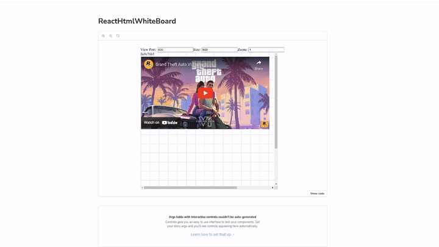

This repository is proof of concept. I wanted to create Figma like board with having HTML code components in mind. Someday I would like to create whole app that will allow you to create whole baord with some complex HTML components inside. Components like kanban board or embeded iframes. Tools like Figma are not designed with that in mind so I tried to recreate this concept using HTML intead of Canvas API. You can read more [on my blog](https://www.filipizydorczyk.pl/article?article=Creating+canvas+baord+with+native+HTML)

